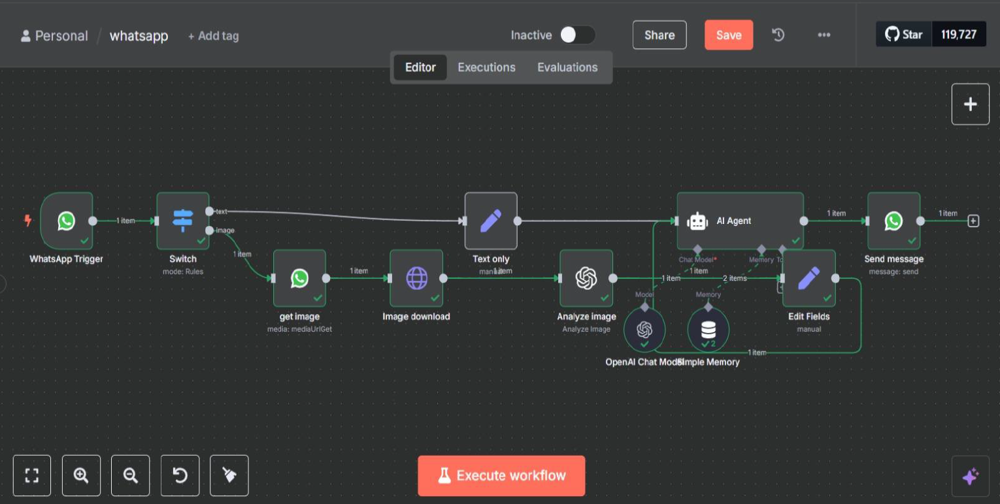
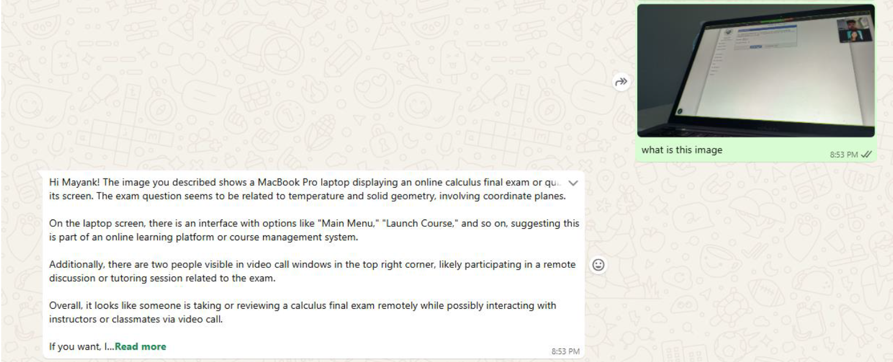
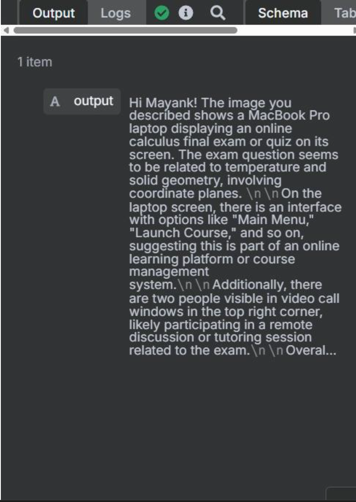

# 🤖 AI WhatsApp Chatbot (Multimodal AI System)

A production-style AI chatbot built on WhatsApp that supports **text + image inputs**, delivers **context-aware responses**, and runs on a fully automated **n8n workflow pipeline**.

---

## 📌 Overview

This system transforms WhatsApp into an intelligent assistant capable of:

- Answering real-time user queries  
- Maintaining conversational context  
- Understanding and analyzing images  
- Operating as a 24/7 automated assistant  

Built using **WhatsApp Cloud API + GPT-4.0 mini + n8n**, the system mimics real-world AI deployment architecture.

---

## 🧠 Key Features

✔ Text-based intelligent responses  
✔ Image understanding (captioning + analysis)  
✔ Session-aware conversations  
✔ Real-time webhook-based architecture  
✔ Fully automated pipeline  

---

## ⚙️ Tech Stack

- **WhatsApp Cloud API** → Messaging interface  
- **n8n** → Workflow orchestration  
- **GPT-4.0 mini** → NLP + vision reasoning  
- **Webhooks + HTTP nodes** → Real-time processing  

---

## 🔄 System Architecture

---

## 🔁 Workflow Breakdown

### 1. WhatsApp Webhook Trigger
- Receives incoming messages (text or image)  
- Uses Meta WhatsApp Business API  

---

### 2. Input Routing (Switch Node)
- Detects message type:
  - Text → GPT pipeline  
  - Image → Image processing pipeline 

---

### 3. Text Processing Pipeline

- Extracts user message  
- Sends to GPT-4.0 mini  
- Generates contextual reply  
- Sends response back via WhatsApp API 

---

### 4. Image Processing Pipeline

#### Step 1 — Image Retrieval
- Fetches media using WhatsApp API  
- Converts media ID → downloadable image   

#### Step 2 — Image Download
- Uses authenticated HTTP request  
- Prepares image for AI processing 

#### Step 3 — AI Image Analysis
- Sends image to GPT with prompt:
  > "Describe this image"  
- Generates contextual caption or interpretation 

---

### 5. AI Agent Layer

- Applies system prompt for tone and behavior  
- Uses memory for contextual responses  
- Controls output consistency (tokens, temperature)  

---

### 6. Response Delivery

- Formats output message  
- Sends via WhatsApp Cloud API  
- Supports personalized responses and formatting 

---

## 📸 Screenshots

### 🔁 Workflow

### 💬 Chat Example

### 🖼️ Image Analysis

---

## 🚀 Example Output

User:  
> "Can you tell me gas prices in Pennsylvania?"

Bot:  
> Provides real-time contextual answer with follow-up suggestion  

---

## 📈 Impact

- Demonstrates real-world AI system design  
- Enables automated customer support  
- Scales to production-level messaging systems  
- Reduces human workload significantly  

---

## 📁 Repository Structure
